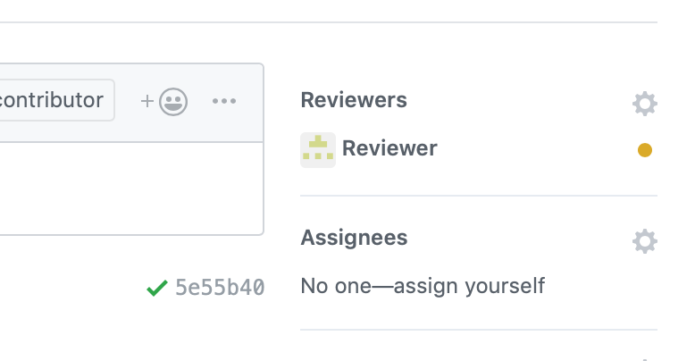

Discord: https://discord.gg/yHBRrj4

# 參與方式

1. fork 專案
1. 到 Issues 尋找有興趣的 issue
2. 在下面的討論表明自己有興趣參與這個 issue
3. 在 Discord 或 Issue 的討論串和 Owner 討論
4. 得到 Owner 認可後開始實作
5. 實作完提交 PR
6. 修改 PR 到 Reviewer merge 你的 PR

指定 Reviewer 的方法：

# 程式碼相關

* 請用符合 C11 規格的純 C 語言實作，且不要破壞封裝的架構
* 非必要不得使用全域變數
* 除了 for 迴圈迭代需要的暫時變數 i,j,k....，以及太長的單字之外，變數命名請使用全名
  Ex:
  - ctx (X) => context (Ｏ)
  - int a, aa (X)
  - for(int i = 0; i < 3; ++i)  (Ｏ)
* 在原始碼檔(.c)內使用的函式，如果沒有出現在標頭檔，請宣告為 static
* 請不要隨意增減函式的參數和回傳值
* 除了標準函式庫之外，非必要不要加入其他函式庫

# GitHub

* 實作新功能請開新的 branch，不要直接在 master 做
* 一個 PR 理想的狀況是 1~3 個 commit，最多 5~6 個
  
  有重複的自己要 squash，或是分成不同的 PR，不要在一個 PR 實作太多功能
