# 系統架構

 

WasmVM 主要分成三個元件，載入元件(Loader)、執行元件(Executor)加速元件(Accelerator)，每個元件中有不同的模組執行各種工作。圖中包住許多零件的大長方形表示各個元件，白色的小長方形表示各個模組。

元件和模組之間會進行各種資料轉換，各種資料結構用藍色平行四邊形表示。

在執行元件(Executor)中，執行的函式分成原生函式(Native)、執行函式(Runtime)和系統呼叫(Syscall)三種，以淺綠色圓角矩形表示。

以下將會介紹各個元件，資料格式的部分請參考 [WebAssembly 規格](https://webassembly.github.io/spec/core/index.html)

# 載入元件 (Loader)

在程式中直接操作 Wasm 位元碼很不方便，而且目前我們也沒辦法直接在機器上執行 Wasm 位元碼。載入元件的工作就是將 Wasm 解析成方便程式操作的格式，驗證要執行的 Wasm 模組，並且載入到執行器中。

載入元件包含以下模組：

## 解碼器 (Decoder)

解碼器的作用是讀取 Wasm 位元檔，解析每個 byte 所代表的意義，並轉成方便操作的 Wasm 模組，交給驗證器做驗證。

如果 Wasm 位元檔的格式不符合 Wasm 規格，解碼器會停止當下的解碼，並回報錯誤。

## 驗證器 (Validator)

在解碼器產生 Wasm 模組後，驗證器會依據規格書上的驗證定義，驗證 Wasm 模組的行為。

如果 Wasm 模組的行為不符合 Wasm 規格，驗證器會回報錯誤。

在驗證完成之後，驗證器會將 Wasm 模組傳給實例產生器。

## 實例產生器 (Instantiator)

解碼器產生的 Wasm 模組包含很多資訊，方便分析和驗證，但是不方便執行。

實例產生器會把 Wasm 模組轉換成 Wasm 實例，存進執行元件的儲存空間(Store)準備執行，同時傳給加速元件的分析器。

# 加速元件 (Accelerator)

及時編譯 (Just-In-Time compile) 是在程式正在執行或快要執行的時候，把程式編譯成可以直接執行的機器碼，加快之後執行時的效能。

加速元件會對 Wasm 模組做分析，把必要的函式編譯成機器碼加速執行。

加速元件包含以下模組：

## 分析器 (Analyzer)

分析器會分析 Wasm 模組內每個函式的使用頻率和特性，決定哪些函式會被及時編譯成原生函式(Native Function)，並安排及時編譯的優先順序。

## 及時編譯器 (JIT Compiler)

及時編譯器按照分析器分析完的優先順序，將 Wasm 模組的函式編譯成原生函式，再交給執行元件做利用

# 執行元件 (Executor)

執行元件在實例產生器處理完之後，執行主要模組的起始函式，讓程式開始運作。

執行元件包含以下模組：

## 儲存空間 (Store)

儲存空間的架構對應到規格裡的 [Store](https://webassembly.github.io/spec/core/exec/runtime.html#store)。接受實例產生器產生的結果，存到對應的欄位中，提供核心使用。

一個執行中的程式可能會使用多個核心，但是儲存空間是所有核心共用的。

## 核心 (Core)

核心是最主要的執行單位，擁有自己的堆疊([Stack](https://webassembly.github.io/spec/core/exec/runtime.html#stack)) 和計數器(Program Counter)。

核心會按照計數器依序提取指令，執行以下動作

1. 執行對應的執行函式(Runtime Function)
2. 遇到 `unreachable` 時觸發系統呼叫(SysCall)
3. 呼叫已經及時編譯完的原生函式(Native Function)

一個執行中的程式可能會使用多個核心，不同核心間的堆疊和計數器是獨立的，但是會共用儲存空間。

## 系統呼叫 (SysCall)

有些和系統有關的操作(例如：輸入輸出)，或是 WebAssembly 沒有定義的操作(例如:例外處理)，無法在 WebAssembly 裡直接執行。

在規格中可以引入外在的原生函式，直接呼叫外在的原生函式來進行操作，但是 WasmVM 並不允許直接呼叫外在的原生函式。

WasmVM 必須利用 `unreachable` 指令觸發系統呼叫，再執行系統呼叫模組中對應的處理函式(SysCall Function)處理系統呼叫，間接的進行系統操作，做到類似軟體中斷(Software Interrupt)的效果。

要執行系統呼叫，必須在堆疊內先放進需要的值當作引數，再放進對應的 `i32` 的常數作為系統呼叫編號，最後執行 `unreachable` 指令觸發系統呼叫。

範例：

假設定義 0 號為兩數相加的系統呼叫，以函式的方式表示為 add(i32 a, i32 b)

如果想把 a 帶入 5，b 帶入 3 做相加，指令可以寫成：

```
i32.const 5     ;; i32 a
i32.const 3     ;; i32 b
i32.const 0     ;; 編號
unreachable     ;; 執行系統呼叫
```

執行完在堆疊裡就會出現結果 8
