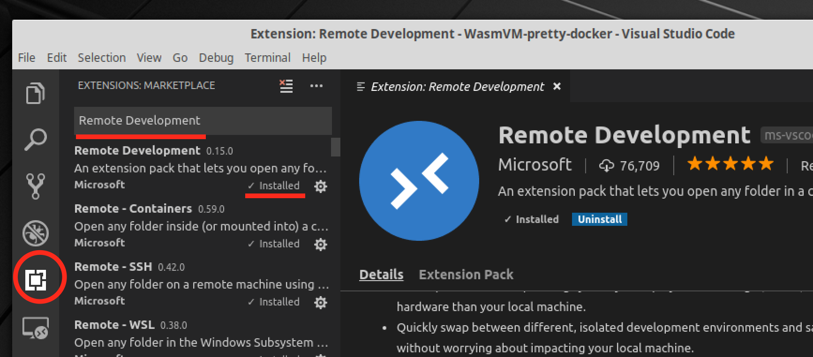
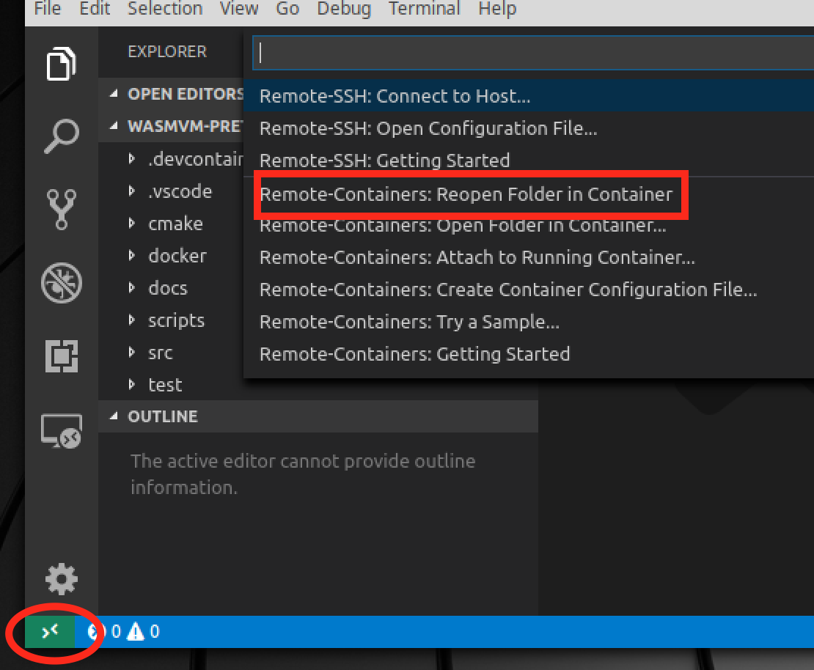
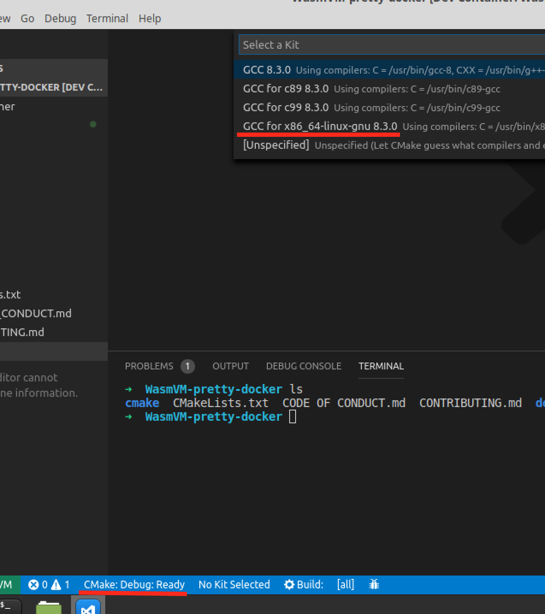
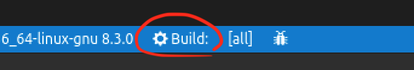

# 使用 VSCode 搭配 Docker 開發 WasmVM

在 VSCode 推出 VSCode Remote Container 擴充套件之後，可以透過 VSCode 和 Docker 建立簡單的開發環境

# Step 1: 安裝並打開 Docker

## Windows

### 1-1. 下載安裝檔後點開安裝檔，照著步驟安裝

  [連結](https://download.docker.com/win/stable/Docker%20for%20Windows%20Installer.exe)

### 1-2. 打開 Docker

## Mac

### 1-1. 下載安裝檔

  [連結](https://download.docker.com/mac/stable/Docker.dmg)

### 1-2. 點開安裝檔，把 Docker 的圖示拖曳到資料夾的圖示

### 1-3. 打開 Docker

## Ubuntu

請參考 https://docs.docker.com/install/linux/docker-ce/ubuntu/#install-using-the-repository

# Step 2: 安裝 VSCode

到下載頁面 https://code.visualstudio.com/Download

照自己的作業系統下載安裝檔來安裝

# Step 3: 下載專案

用 `git clone`，或是[下載壓縮檔](https://github.com/WasmVM/WasmVM/archive/master.zip)之後解壓縮

# Step 4: 用 VSCode 打開專案

在左上角的 `檔案(File)` 選單選 `打開資料夾 (Open Folder)` 

# Step 5: 安裝 Remote Development 擴充套件

照著圖上的方式點選按鈕

# Step 6: 用 Remote Development 打開專案

點選左下角的綠色按鈕之後，選 `Reopen Folder in Container`

# Step 7: 設定 CMake

點選左下角的 `CMake: Debug: Ready`，再點選 `GCC for x86_64` > `Debug`

# Step 8: 編譯

點選靠近中間的 `Build: all` 可以編譯

